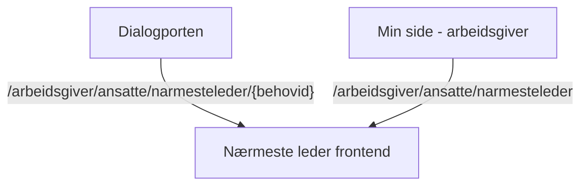

# Nærmesteleder frontendapp

**Viktig:** For å komme i gang med bygging og kjøring av appen, les vår [wiki for Next.js-applikasjoner](https://github.com/navikt/esyfo-dev-tools/wiki/nextjs-build-run).

## Formålet med appen

Appen brukes til å registrere en **nærmeste leder** for en person som er sykmeldt. Den tilbyr to hovedfunksjoner.

### Registrering via tomt skjema

Inngangen til det tomme skjemaet er appen `Min side - arbeidsgiver`. Brukeren fyller ut informasjon om både den sykmeldte og **nærmeste leder**.

**basePath**[^basepath] `/arbeidsgiver/ansatte/narmesteleder`

### Registrering via forhåndsutfylt skjema

Inngangen til det forhåndsutfylte skjemaet er plattformen `Dialogporten`. Brukeren får presentert en bestemt sykmeldt som mangler **nærmeste leder**, og kan registrere eller oppdatere **nærmeste leder**.

**basePath**[^basepath] `/arbeidsgiver/ansatte/narmesteleder/{behovid}`

## Backend-API

Frontend-appen kommuniserer med [Nærmesteleder backend](https://github.com/navikt/esyfo-narmesteleder).

Brukte endepunkter

- **GET** `/api/v1/linemanager/requirement/{id}`
- **POST** `/api/v1/linemanager`
- **PUT** `/api/v1/linemanager/requirement/{id}`

---

[^basepath]: `basePath`-verdien settes i Next.js-konfigurasjonen i `next.config.ts` og angir URL-prefikset som hele appen lever under.
