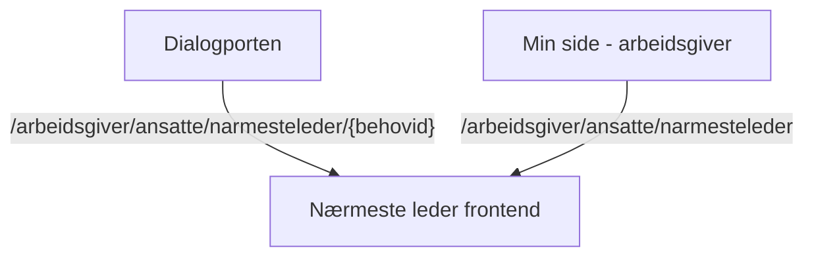

# Nærmesteleder frontend app

**Important:** To get started with building and running the app, read our [wiki for Next.js apps](https://github.com/navikt/esyfo-dev-tools/wiki/nextjs-build-run).

## Purpose of the app

This app is used to register a **nærmesteleder** for a person on sick leave. It offers two main functions.

### Registration via empty form

The entry point to the empty form is the app `Min side - arbeidsgiver`. The user fills out information about both the person on sick leave and the **nærmesteleder**.

**Base path** `/arbeidsgiver/ansatte/narmesteleder`

### Registration via pre-filled form

The entry point to the pre-filled form is the platform `Dialogporten`. The user is presented with a specific person on sick leave who is missing a **nærmesteleder**, and can register or update the **nærmesteleder**.

**Base path** `/arbeidsgiver/ansatte/narmesteleder/{behovid}`

## Backend API

The frontend app communicates with [Nærmesteleder backend](https://github.com/navikt/esyfo-narmesteleder).

Used endpoints

- **GET** `/api/v1/linemanager/requirement/{id}`
- **POST** `/api/v1/linemanager`
- **PUT** `/api/v1/linemanager/requirement/{id}`
